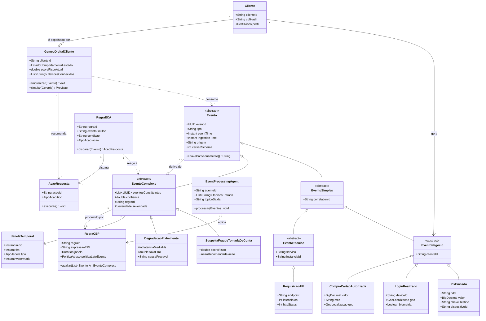
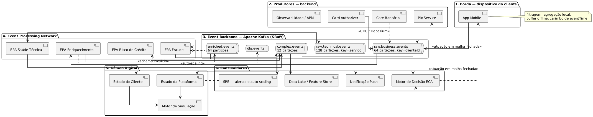
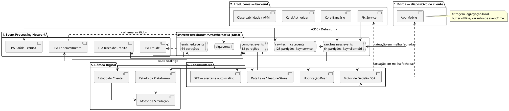
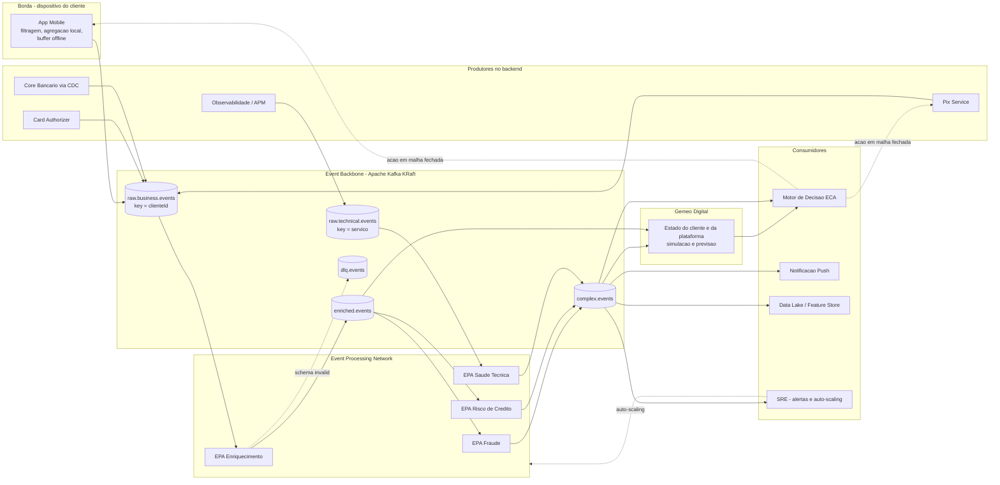
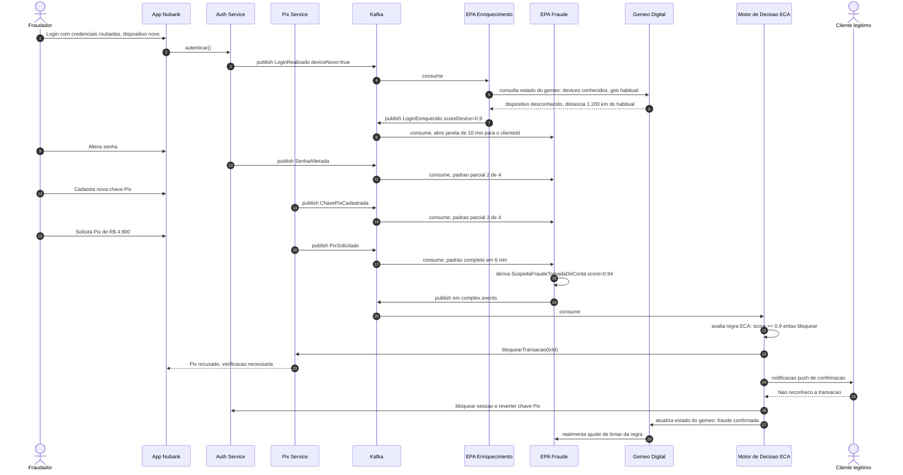
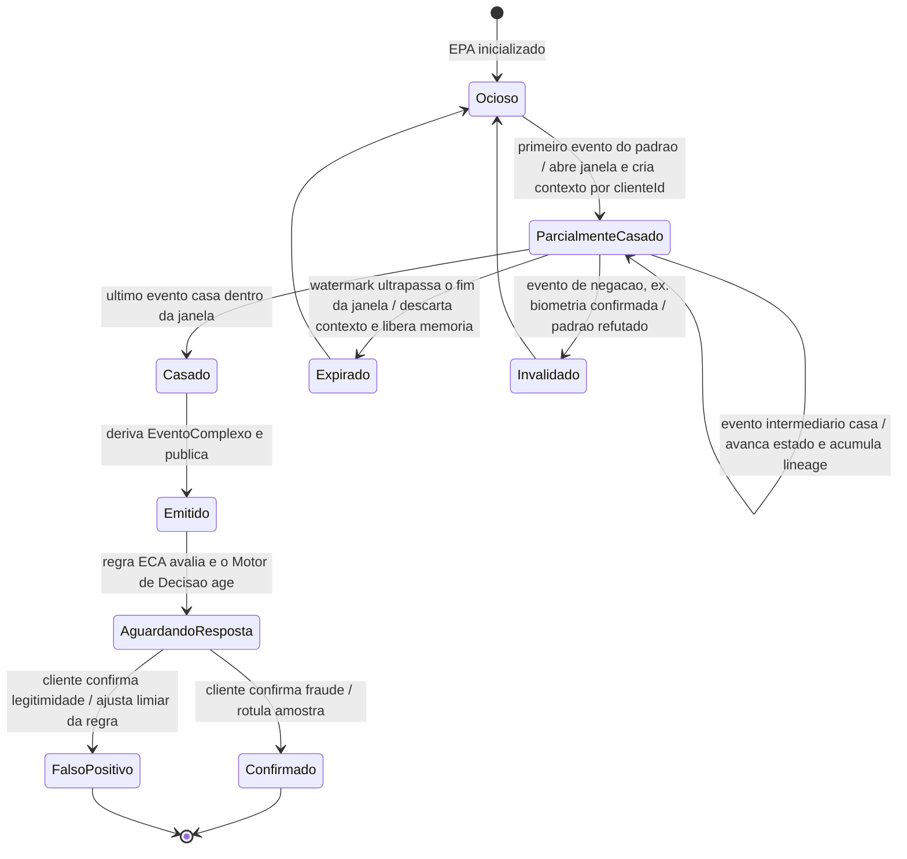
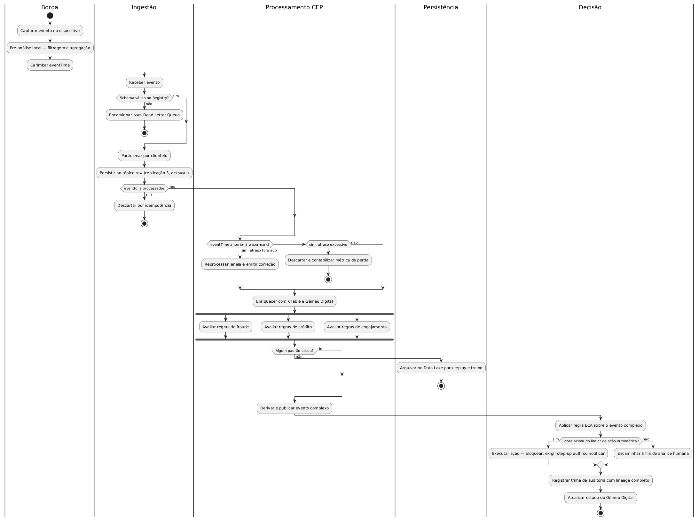
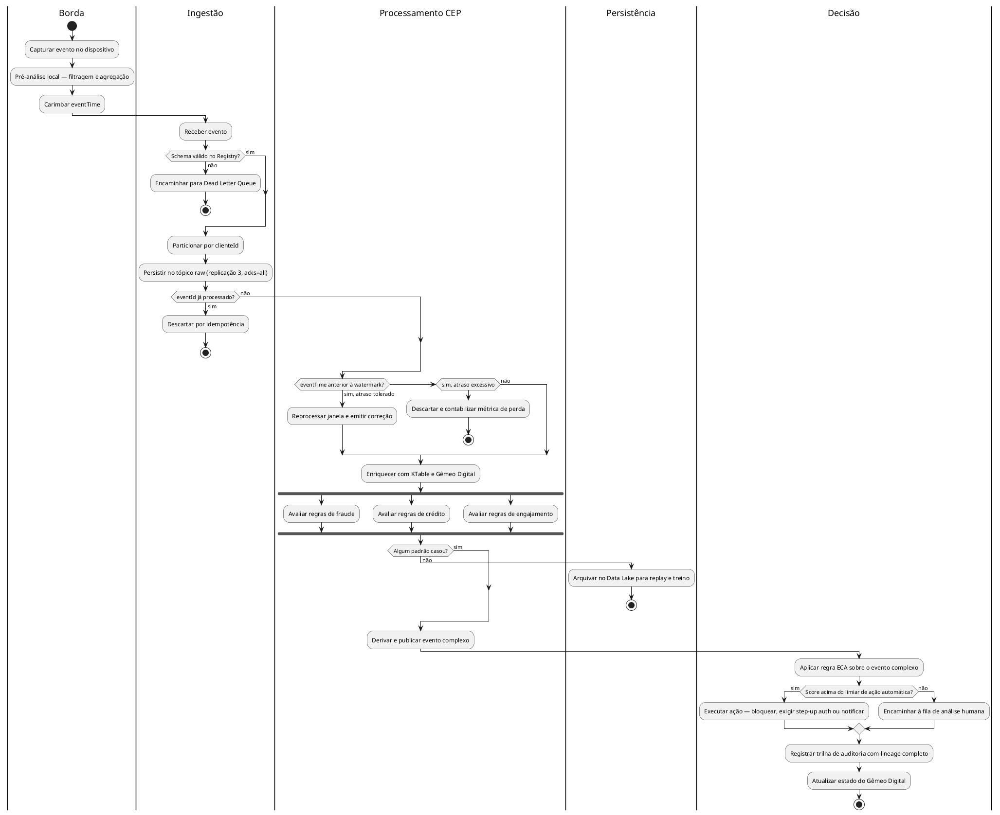
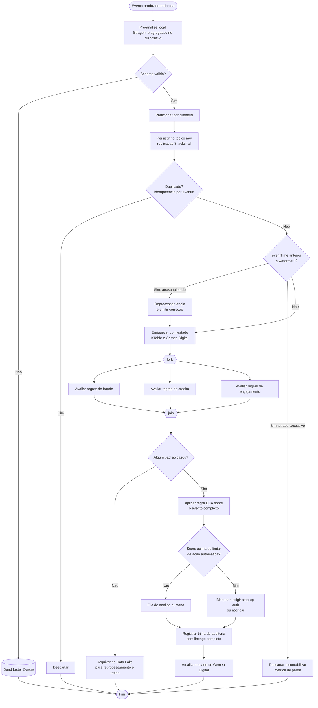

# Processamento de Eventos Complexos aplicado a um aplicativo bancário digital (Nubank)

**Autor:** Rodrigo Hu Tchie Lee — Engenharia de Software, Inteli
**Disciplina:** PCS5839 — Módulo 11: Processamento de Eventos Complexos e Gêmeos Digitais
**Data:** 18 de setembro de 2026

> **Escopo.** Atividade ponderada sobre CEP. O enunciado pede três entregas: identificar eventos simples e complexos, de negócio e técnicos, em um aplicativo bancário digital brasileiro; elaborar modelagem estática e dinâmica em UML desses eventos; e construir três cenários de negócio justificando o ganho de eficiência transacional. O trabalho segue o template operacional da aula — **Identificar, Modelar, Decidir** — e incorpora os instrumentos apresentados no briefing: regra ECA, visões RM-ODP, Gêmeo Digital com malha fechada e avaliação de trade-offs por ATAM sobre a ISO/IEC 25010:2023.

> **Escolha do banco.** O enunciado permite Nubank, BTG, Itaú ou Bradesco. Adotou-se o **Nubank** por três razões que maximizam a densidade de eventos e, portanto, o valor analítico do estudo. Primeiro, é um banco digital nativo: não há canal de agência física nem processamento em lote herdado de mainframe competindo com o fluxo de eventos, de modo que praticamente toda interação do cliente já nasce como evento digital. Segundo, sua base é concentrada em conta de pagamento e cartão de crédito, os dois produtos com maior frequência transacional por cliente, o que torna as janelas curtas de correlação densas o bastante para que padrões sejam estatisticamente detectáveis. Terceiro, a escala de Pix e de autorizações de cartão coloca o sistema exatamente no regime em que a arquitetura orientada a eventos deixa de ser opcional — é onde o modelo batch tradicional falha de forma observável. Um banco tradicional como Itaú ou Bradesco introduziria a complexidade adicional de conciliar canais legados, e o BTG deslocaria o foco para eventos de mercado e ordens, afastando-se do núcleo transacional que o enunciado pede.

---

## Sumário

1. [Fundamentação conceitual de CEP](#1-fundamentação-conceitual-de-cep)
2. [Identificar — eventos simples e complexos](#2-identificar--eventos-simples-e-complexos)
3. [Modelar — modelagem estática em UML](#3-modelar--modelagem-estática-em-uml)
4. [Modelar — modelagem dinâmica em UML](#4-modelar--modelagem-dinâmica-em-uml)
5. [Modelar — visões RM-ODP](#5-modelar--visões-rm-odp)
6. [Decidir — Gêmeo Digital e trade-offs arquiteturais](#6-decidir--gêmeo-digital-e-trade-offs-arquiteturais)
7. [Cenários de negócio](#7-cenários-de-negócio)
8. [Síntese](#8-síntese)
9. [Como montar o repositório-resposta](#9-como-montar-o-repositório-resposta)
10. [Referências](#10-referências)

---

## 1. Fundamentação conceitual de CEP

### 1.1 Evento simples e evento complexo

Processamento de Eventos Complexos é o paradigma de processamento contínuo de fluxos cujo objetivo não é registrar fatos isolados, mas detectar padrões de correlação entre eles e derivar, a partir dessa correlação, informação de nível semântico superior. Como sintetiza o briefing da aula, CEP não é apenas processar dados: é identificar situações de negócio no milissegundo em que elas importam.

Um evento simples, também chamado de evento bruto ou telemetria, é o registro atômico e imutável de um fato ocorrido em um instante determinado. Ele é autocontido: existe independentemente de qualquer outro evento e sua semântica está inteiramente descrita em seus próprios atributos. Um Pix enviado, um login realizado, uma compra de cartão autorizada são eventos simples. São exatamente o tipo de registro que qualquer sistema bancário convencional já produz e armazena.

Um evento complexo, ou evento derivado, não é observado diretamente: é inferido por um motor de processamento a partir da correlação de dois ou mais eventos, sob restrições explícitas de janela temporal, sequência, agregação ou ausência. Ele não existe em nenhum log de origem, e é essa a razão pela qual CEP acrescenta valor. A detecção de fraude por tomada de conta ilustra o ponto: trocar a senha é legítimo, cadastrar uma chave Pix é legítimo, enviar quatro mil e novecentos reais é legítimo. Cada evento, isoladamente, é ruído. A fraude só passa a existir quando os três acontecem na mesma sequência, para o mesmo cliente, dentro de uma janela de poucos minutos e a partir de um dispositivo não reconhecido. O padrão é a informação; os eventos são apenas o substrato.

### 1.2 A regra ECA e sua diferença em relação ao evento complexo

O briefing pede explicitamente que se diferencie a telemetria simples da regra ECA e ambas do evento complexo, e a distinção merece cuidado porque é onde a maioria dos projetos erra.

A regra ECA — Event, Condition, Action — é o formalismo reativo clássico: quando um evento chega, avalia-se uma condição sobre ele, e se a condição for verdadeira executa-se uma ação. A forma canônica é "ON evento IF condição THEN ação". Uma regra ECA típica em um banco seria: ao receber `PixEnviado`, se o valor for superior a cinco mil reais, exigir biometria. Ela é **stateless em relação ao histórico**: decide olhando um único evento e, no máximo, estado consultável externamente.

O evento complexo opera em outro nível. Ele exige **estado acumulado sobre uma janela**, correlaciona eventos de tipos diferentes e produz um novo evento como saída, não uma ação. A relação correta entre os dois conceitos é de composição em camadas: o CEP deriva o evento complexo, e uma regra ECA aplicada sobre esse evento derivado é que dispara a ação. Em notação:

```
Camada 1 (telemetria)    : PixEnviado, LoginRealizado, SenhaAlterada        -- fatos brutos
Camada 2 (CEP)           : SEQ(LoginRealizado[deviceNovo], SenhaAlterada,
                               ChavePixCadastrada, PixEnviado) WITHIN 10min
                           -> SuspeitaFraudeTomadaDeConta                   -- evento derivado
Camada 3 (ECA)           : ON SuspeitaFraudeTomadaDeConta
                           IF scoreRisco >= 0.9
                           THEN bloquearTransacao() AND exigirVerificacao() -- ação
```

Confundir as camadas produz o antipadrão mais comum em antifraude: escrever centenas de regras ECA sobre eventos brutos, o que gera uma explosão combinatória de regras que ninguém consegue manter e uma taxa de falso positivo que inviabiliza a operação. Separar as camadas mantém as regras ECA simples e concentra a complexidade no motor de padrões, onde ela é declarativa e testável.

### 1.3 EPA, EPN e o papel do Kafka

Dois conceitos operacionais organizam a implementação. O Event Processing Agent, ou EPA, é a unidade de processamento que consome eventos, aplica regras de correlação e produz eventos novos. A Event Processing Network, ou EPN, é o grafo formado por esses agentes conectados por canais de eventos. Na prática, a EPN se materializa como um conjunto de tópicos Kafka ligados por jobs de Flink, Kafka Streams ou ksqlDB.

É importante separar com clareza o papel do Kafka do papel do CEP. O Kafka é o event backbone: responde pela questão de como os eventos trafegam com alta vazão, durabilidade e tolerância a falhas. O CEP é a camada de raciocínio construída sobre esse backbone: responde pela questão do que esses eventos, tomados em conjunto, significam. Mas o Kafka não é acessório, e sim condição necessária, por quatro razões concretas. Primeiro, o particionamento por chave garante que todos os eventos de um mesmo cliente sejam roteados para a mesma partição, e como o Kafka assegura ordem dentro da partição — nunca globalmente — a ordem causal necessária à correlação temporal é preservada. Segundo, a retenção baseada em offsets permite reprocessar o histórico, o que viabiliza o backtesting de regras antes de colocá-las em produção. Terceiro, os consumer groups permitem escalar horizontalmente os agentes, com o group coordinator redistribuindo partições quando agentes entram ou saem. Quarto, o Change Data Capture alimenta a rede com mudanças de estado do core bancário, convertendo dados em repouso em eventos de fluxo.

### 1.4 Tempo de evento, atraso e watermarks

Um ponto que o briefing levanta no contexto de rede móvel e que se aplica integralmente ao aplicativo bancário: o instante em que o evento ocorreu não é o instante em que ele chega ao processador. Um cliente em área de cobertura ruim pode ter a solicitação de Pix registrada no dispositivo às 14h02 e entregue ao backend às 14h05. Um motor CEP que ordene por tempo de chegada em vez de tempo de evento correlaciona errado e perde padrões.

A solução padrão é processar por **event time** com **watermarks**: o motor mantém uma estimativa de até que ponto no tempo de evento já recebeu tudo o que era esperado, e só fecha uma janela quando a watermark a ultrapassa. Eventos que chegam depois disso são tratados por uma política explícita de late events — descarte, com contabilização em métrica, ou reprocessamento da janela com emissão de correção. Em um contexto bancário a escolha não é indiferente: para detecção de fraude, descartar um evento atrasado significa deixar passar a fraude, de modo que a política correta é permitir atraso tolerado curto com reprocessamento, aceitando o custo de emitir alertas retificados.

---

## 2. Identificar — eventos simples e complexos

### 2.1 Eventos simples de negócio

No domínio de um banco digital como o Nubank, os eventos simples de negócio correspondem às ações que o cliente executa e aos fatos que o próprio banco registra sobre a relação com ele. Do lado da identidade e do acesso, temos `ContaAberta`, `LoginRealizado` (com dispositivo, geolocalização e indicação de uso de biometria), `SenhaAlterada` e `DispositivoCadastrado`. Do lado transacional, `PixEnviado` e `PixRecebido` (com identificador da transação, valor e chave de destino), `ChavePixCadastrada`, `CompraCartaoAutorizada` e `CompraCartaoNegada` (com valor, código MCC do estabelecimento e geolocalização). Do lado do crédito e do relacionamento, `FaturaFechada`, `FaturaPaga`, `LimiteAlterado`, `EmprestimoSimulado`, `EmprestimoContratado`, `InvestimentoAplicado`, `InvestimentoResgatado` e `ChamadoAberto`.

Todos compartilham a mesma característica: descrevem um fato consumado, carregam um instante de ocorrência e não dependem de nenhum outro evento para serem interpretados.

### 2.2 Eventos simples técnicos

A camada técnica produz seu próprio fluxo, com volume tipicamente uma ou duas ordens de grandeza superior ao de negócio. Da borda da aplicação vêm `RequisicaoAPI` (com endpoint, latência em milissegundos e status HTTP) e `AppCrash` (com versão do aplicativo, sistema operacional e tela de origem). Dos microsserviços vêm `ErroServico`, `TimeoutIntegracao` — nas integrações com o SPI do Banco Central, bureaus de crédito e adquirentes — e `CircuitBreakerAberto`. Da infraestrutura de mensageria vêm `ConsumerLagAlterado`, `RebalanceIniciado` e `ReplicaForaDoISR`. Da esteira de entrega vem `DeployRealizado`, e da observabilidade, `PicoCPU` e `PicoMemoria`.

### 2.3 Contrato de evento

Antes de correlacionar é preciso fixar o contrato. Todo evento deste sistema obedece ao mesmo envelope, versionado em Schema Registry com Avro, o que permite evolução compatível sem quebrar consumidores:

```json
{
  "eventId": "uuid-v7",
  "tipo": "PixEnviado",
  "versaoSchema": 3,
  "eventTime": "2026-09-18T14:02:11.442-03:00",
  "ingestionTime": "2026-09-18T14:05:03.118-03:00",
  "origem": "pix-service",
  "chaveParticionamento": "cliente-9f2a...",
  "correlationId": "sessao-77b1...",
  "payload": {
    "txId": "E1234...",
    "valor": 4900.00,
    "chaveDestino": "hash-...",
    "dispositivoId": "dev-3c9e..."
  }
}
```

A separação entre `eventTime` e `ingestionTime` é o que viabiliza o tratamento de watermarks descrito na seção 1.4. O `eventId` em UUID v7 é ordenável no tempo e serve à idempotência: reentregas do Kafka, que garante entrega ao menos uma vez, são descartadas por deduplicação nessa chave.

### 2.4 Eventos complexos de negócio

Os eventos complexos de negócio resultam da aplicação de operadores de correlação sobre os eventos simples acima. Vale detalhar os mais representativos, porque cada um exercita um operador diferente.

`SuspeitaFraudeTomadaDeConta` usa **sequência com janela temporal**: exige que `LoginRealizado` com dispositivo novo seja seguido de `SenhaAlterada`, depois `ChavePixCadastrada` e por fim `PixEnviado`, tudo para o mesmo cliente e dentro de dez minutos.

`PadraoSaqueRelampago` usa **agregação com threshold em janela deslizante**: pelo menos cinco ocorrências de `PixEnviado` cuja soma ultrapasse oitenta por cento do saldo inicial, em janela de três minutos.

`TransacaoGeograficamenteImpossivel` aplica **correlação espaço-temporal**, o mesmo padrão que o briefing apresenta na rastreabilidade de lotes farmacêuticos: duas autorizações de cartão em localizações cuja distância, dividida pelo intervalo entre elas, resulta em velocidade de deslocamento fisicamente impossível.

`RiscoInadimplenciaIminente` combina **agregação multi-fonte com operador de ausência**: três ou mais recusas por saldo insuficiente em sete dias, somadas à ausência de qualquer `PixRecebido` em quinze dias e ao pagamento apenas do valor mínimo da última fatura.

`ClienteEmJornadaDeAbandono` é construído quase inteiramente sobre **não-ocorrência**: ausência de `LoginRealizado` por vinte e um dias, saldo abaixo de cinquenta reais e um chamado de reclamação nos trinta dias anteriores.

`LavagemDeDinheiroEstruturada`, o padrão conhecido como smurfing, exige **agregação sobre grafo de contrapartes**: dez ou mais recebimentos de contas distintas, todos abaixo do limiar de comunicação obrigatória, em vinte e quatro horas, seguidos de envio único do valor agregado.

`OportunidadeCrossSellInvestimento` demonstra que CEP não serve apenas ao risco: acúmulo líquido superior a três mil reais em trinta dias combinado com ausência de aplicação em noventa dias identifica o momento exato de ofertar um produto de investimento.

### 2.5 Eventos complexos técnicos

No plano técnico a lógica é a mesma. `DegradacaoPixIminente` correlaciona a tendência de latência média do endpoint de Pix acima de oitocentos milissegundos por dois minutos com dez ou mais timeouts na integração com o SPI na mesma janela. `DeployRegressivo` aplica correlação causal: um deploy seguido, em quinze minutos, de taxa de erro do mesmo serviço três vezes acima da linha de base. `BackpressureNoPipelineCEP` detecta crescimento monotônico do consumer lag por cinco janelas consecutivas somado a rebalances repetidos, sinalizando que a própria rede de processamento está saturando. `RiscoPerdaDeDadosNoBroker` correlaciona réplicas fora do conjunto em sincronia com pico de CPU no broker líder. `IndisponibilidadeParcialDetectada` dispara quando três ou mais circuit breakers de serviços distintos abrem em sessenta segundos.

### 2.6 Tabela consolidada: da telemetria ao evento complexo

A tabela abaixo reúne, em visão única, o mapeamento completo exigido pela questão 1: cada evento complexo, os eventos simples que o constituem, o operador CEP empregado, a janela e a ação ECA correspondente.

| # | Evento complexo | Tipo | Eventos simples constituintes | Operador CEP | Janela | Ação ECA disparada |
|---|---|---|---|---|---|---|
| N1 | `SuspeitaFraudeTomadaDeConta` | Negócio | `LoginRealizado`, `SenhaAlterada`, `ChavePixCadastrada`, `PixEnviado`, `BiometriaConfirmada` (negação) | Sequência + negação | 10 min | Bloquear transação e exigir verificação |
| N2 | `PadraoSaqueRelampago` | Negócio | `PixEnviado` (n ocorrências), saldo corrente | Agregação + threshold | 3 min deslizante | Limitar valor por transação e notificar |
| N3 | `TransacaoGeograficamenteImpossivel` | Negócio | `CompraCartaoAutorizada` (2 ocorrências com geo) | Correlação espaço-temporal | 6 h | Recusar segunda autorização e alertar |
| N4 | `RiscoInadimplenciaIminente` | Negócio | `CompraCartaoNegada`, `PixRecebido` (ausência), `FaturaPaga`, `EmprestimoSimulado` | Agregação multi-fonte + ausência | 7 e 30 dias | Encaminhar à esteira de renegociação |
| N5 | `ClienteEmJornadaDeAbandono` | Negócio | `LoginRealizado` (ausência), saldo, `ChamadoAberto` | Não-ocorrência | 21 e 30 dias | Acionar régua de retenção |
| N6 | `LavagemDeDinheiroEstruturada` | Negócio | `PixRecebido` (n contrapartes distintas), `PixEnviado` | Agregação sobre grafo + sequência | 24 h | Reter e comunicar ao COAF |
| N7 | `OportunidadeCrossSellInvestimento` | Negócio | `PixRecebido`, `PixEnviado`, `InvestimentoAplicado` (ausência) | Agregação de saldo líquido + ausência | 30 e 90 dias | Ofertar produto de investimento |
| N8 | `ClienteEmDificuldadeFinanceira` | Negócio | `LimiteAlterado`, `EmprestimoSimulado`, `FaturaPaga` (parcial) | Sequência de degradação | 30 dias | Ofertar parcelamento preventivo |
| T1 | `DegradacaoPixIminente` | Técnico | `RequisicaoAPI`, `TimeoutIntegracao` | Tendência + threshold conjunto | 2 min | Rate limiting e modo degradado |
| T2 | `DeployRegressivo` | Técnico | `DeployRealizado`, `ErroServico` | Correlação causal | 15 min | Rollback automático |
| T3 | `BackpressureNoPipelineCEP` | Técnico | `ConsumerLagAlterado`, `RebalanceIniciado` | Tendência monotônica | 10 min | Escalar consumer group |
| T4 | `RiscoPerdaDeDadosNoBroker` | Técnico | `ReplicaForaDoISR`, `PicoCPU` | Correlação de infraestrutura | 5 min | Alertar SRE e bloquear deploy |
| T5 | `IndisponibilidadeParcialDetectada` | Técnico | `CircuitBreakerAberto` (n serviços) | Agregação por contagem distinta | 60 s | Acionar plano de contingência |
| T6 | `FalhaSistemicaDeOnboarding` | Técnico | `ContaAberta` (queda vs. baseline), `TimeoutIntegracao` | Ausência relativa + threshold | 1 h | Alternar para bureau secundário |

A leitura vertical da coluna de operadores evidencia o argumento central do trabalho: nenhum dos treze padrões pode ser expresso por consulta sobre um único evento. Todos exigem estado acumulado sobre uma janela, e cinco deles dependem de ausência — informação que nenhum banco de dados transacional consulta naturalmente.

### 2.7 Expressão declarativa dos padrões

Para tornar os padrões verificáveis e não apenas descritivos, seguem as duas regras centrais em sintaxe de EPL, próxima da de Esper e traduzível diretamente para FlinkCEP:

```sql
-- Evento complexo de negócio: tomada de conta
SELECT a.clienteId, d.txId, d.valor
FROM PATTERN [
      every a = LoginRealizado(deviceConhecido = false)
   -> b = SenhaAlterada(clienteId = a.clienteId)
   -> c = ChavePixCadastrada(clienteId = a.clienteId)
   -> d = PixEnviado(clienteId = a.clienteId)
] WHERE timer:within(10 minutes)
  AND NOT EXISTS (
      SELECT 1 FROM BiometriaConfirmada(clienteId = a.clienteId).win:time(10 min)
  );

-- Evento complexo técnico: degradação do Pix
SELECT avg(r.latenciaMs) AS latMedia, count(t.*) AS timeouts
FROM RequisicaoAPI(endpoint = '/pix').win:time(2 min) AS r,
     TimeoutIntegracao(integracao = 'SPI').win:time(2 min) AS t
GROUP BY 1
HAVING avg(r.latenciaMs) > 800 AND count(t.*) >= 10;
```

A cláusula `NOT EXISTS` sobre `BiometriaConfirmada` é o evento de negação que refuta o padrão, e corresponde diretamente à transição para o estado `Invalidado` na máquina de estados da seção 4.2.

---

## 3. Modelar — modelagem estática em UML

### 3.1 Diagrama de classes do domínio de eventos

A modelagem estática formaliza a taxonomia apresentada acima. A classe abstrata `Evento` concentra o que é comum a todo evento. Dela descendem duas especializações que refletem exatamente a distinção conceitual central: `EventoSimples`, que não carrega referência a outros eventos, e `EventoComplexo`, que agrega a lista dos eventos que o originaram, a regra que o produziu, a janela em que o padrão foi observado e um grau de confiança. A classe `RegraECA` aparece separada de `RegraCEP` para manter explícita a distinção da seção 1.2.



Quatro decisões de modelagem merecem justificativa. A agregação entre `EventoComplexo` e `Evento` materializa a rastreabilidade causal, o chamado event lineage: dado um alerta, é possível reconstruir exatamente quais eventos o originaram. Isso não é refinamento acadêmico, é requisito de auditoria regulatória e de explicabilidade de decisão automatizada. O atributo `versaoSchema` viabiliza evolução compatível do contrato. O método `chaveParticionamento` é polimórfico de propósito: eventos de negócio retornam o identificador do cliente, garantindo ordem causal por cliente na partição, enquanto eventos técnicos retornam o nome do serviço. E a separação entre `RegraCEP` e `RegraECA`, com a dependência da segunda em relação ao evento derivado pela primeira, formaliza em UML a arquitetura em camadas discutida na seção 1.2.

### 3.2 Diagrama de componentes da Event Processing Network

O segundo diagrama estático descreve a arquitetura de implantação sobre o Kafka, incluindo a separação entre processamento de borda e de nuvem que o briefing exige e o laço de realimentação do Gêmeo Digital.

> **Nota sobre notação.** O Mermaid oferece suporte nativo apenas a diagramas de classes, sequência e estados em notação UML. Para os diagramas de componentes e de atividades, a fonte canônica deste trabalho é **PlantUML**, apresentada primeiro e conforme à especificação UML 2.5. A versão em Mermaid que segue cada uma é uma pré-visualização, incluída porque renderiza diretamente na página do repositório; ela não substitui a fonte UML.

**Fonte UML (PlantUML):**



<details>
<summary>Fonte PlantUML (<code>diagrams/plantuml/componentes-epn.puml</code>)</summary>



</details>

**Pré-visualização (Mermaid):**



As setas tracejadas de retorno representam o vínculo operacional bidirecional que o briefing identifica como condição para que exista um Gêmeo Digital de verdade, e não apenas um painel de monitoramento.

---

## 4. Modelar — modelagem dinâmica em UML

### 4.1 Diagrama de sequência: detecção de fraude em tempo real

O diagrama de sequência mostra o comportamento do sistema ao longo do tempo, com a passagem de mensagens entre os participantes durante uma tentativa de tomada de conta.



Há um ponto crítico de latência nesse fluxo que merece destaque didático, porque é onde o requisito de negócio determina a arquitetura. O intervalo entre a publicação de `PixSolicitado` e a chamada de bloqueio precisa caber inteiramente dentro da janela de autorização do Pix, que o Banco Central estabelece na ordem de dez segundos. Isso inviabiliza qualquer consulta síncrona a banco de dados dentro do agente de fraude. O estado do padrão parcialmente casado precisa ser mantido em memória local ao agente, tipicamente com persistência em RocksDB embarcado, como fazem o Flink e o Kafka Streams. A exigência regulatória de liquidação em segundos, portanto, propaga-se diretamente para uma decisão de implementação de estado.

### 4.2 Diagrama de máquina de estados: ciclo de vida de um padrão

Enquanto o diagrama de sequência mostra uma execução concreta, o diagrama de estados descreve todas as trajetórias possíveis de um padrão CEP no agente.



Dois estados são conceitualmente importantes. O estado `Expirado` é o que impede o crescimento indefinido de memória: contextos de padrões que não se completaram dentro da janela precisam ser descartados, e em um sistema com dezenas de milhões de clientes ativos isso é uma restrição operacional severa — é, na prática, o que dimensiona o cluster. O estado `FalsoPositivo` fecha o ciclo de realimentação: cada refutação pelo cliente alimenta o ajuste dos limiares. Sem esse ciclo, um sistema CEP degrada previsivelmente em fadiga de alertas, e a equipe que deveria agir sobre eles passa a ignorá-los.

### 4.3 Diagrama de atividades: pipeline de processamento

O diagrama de atividades descreve o fluxo de trabalho que todo evento percorre, incluindo validação de contrato, tratamento de eventos atrasados e as bifurcações paralelas de avaliação de regras. Vale a mesma nota de notação da seção 3.2: a fonte UML é PlantUML, com raias de partição e nós de bifurcação e junção conforme a UML 2.5; a versão em Mermaid é pré-visualização.

**Fonte UML (PlantUML):**



<details>
<summary>Fonte PlantUML (<code>diagrams/plantuml/pipeline-cep.puml</code>)</summary>



</details>

**Pré-visualização (Mermaid):**



---

## 5. Modelar — visões RM-ODP

O briefing exige que a arquitetura seja descrita pelas cinco visões do RM-ODP, o modelo de referência para processamento distribuído aberto da ISO/IEC 10746. As visões não são camadas nem etapas: são cinco descrições completas do mesmo sistema, cada uma respondendo a uma pergunta diferente, e a utilidade delas está em separar preocupações que costumam se contaminar.

**Visão de Empresa.** Responde por quê o sistema existe, em termos de objetivos, papéis e políticas. O objetivo é reduzir perda por fraude e por inadimplência e preservar a taxa de sucesso transacional, sem introduzir atrito na jornada do cliente legítimo. Os papéis relevantes são o cliente, o analista de prevenção a fraude, o time de crédito, a equipe de SRE e o regulador. As políticas que obrigam o sistema são a irreversibilidade da liquidação do Pix, o Mecanismo Especial de Devolução, as exigências de comunicação ao COAF, a LGPD quanto ao tratamento de dados pessoais e o direito à revisão de decisão automatizada, que é o que torna a rastreabilidade do lineage um requisito e não uma boa prática.

**Visão de Informação.** Responde o que é manipulado, em termos de semântica e de esquema, independentemente de implementação. É exatamente o conteúdo da seção 3.1: a hierarquia de eventos, o envelope versionado da seção 2.3, o estado do Gêmeo Digital do cliente e as regras de integridade — imutabilidade do evento, identidade por `eventId`, ordenação por `eventTime`, e a invariante de que todo evento complexo referencia ao menos dois eventos constituintes existentes.

**Visão de Computação.** Responde como o sistema se decompõe em objetos computacionais com interfaces bem definidas, sem decidir onde eles rodam. Aqui aparecem os EPAs como unidades funcionais, com suas interfaces de consumo e produção, o Motor de Decisão com sua interface de regras ECA, o serviço de Gêmeo Digital com suas operações de sincronização e simulação, e a política de que nenhum EPA faz chamada síncrona bloqueante a serviço externo dentro do caminho de decisão.

**Visão de Engenharia.** Responde como a distribuição é realizada: transparências, canais e infraestrutura. É onde entram o Kafka como canal, a escolha de partições por `clienteId`, o fator de replicação três com `acks=all`, os consumer groups e o comportamento de rebalanceamento, o estado local em RocksDB com checkpointing, a divisão entre processamento de borda (filtragem e buffer offline no dispositivo, essencial em rede móvel instável) e processamento de nuvem, e a Dead Letter Queue como mecanismo de contenção de falha.

**Visão de Tecnologia.** Responde com o quê, nomeando os produtos concretos: Apache Kafka em modo KRaft, Apache Flink com FlinkCEP para os padrões de sequência e janela, ksqlDB para agregações mais simples, Debezium para CDC do core bancário, Confluent Schema Registry com Avro, RocksDB para estado local, S3 como data lake, e k6 ou JMeter para a avaliação experimental de latência e resiliência.

A razão prática de manter as cinco visões separadas é que elas mudam em ritmos diferentes. A visão de Empresa muda quando a regulação muda; a de Tecnologia muda a cada ciclo de renovação de stack. Um documento que mistura as duas obriga a reescrever a justificativa de negócio toda vez que se troca de motor de streaming.

---

## 6. Decidir — Gêmeo Digital e trade-offs arquiteturais

### 6.1 O Gêmeo Digital do cliente e da plataforma

O briefing é explícito ao afirmar que um Gêmeo Digital real exige vínculo operacional bidirecional. Isso distingue três coisas frequentemente confundidas. Um **modelo** é uma representação estática. Uma **sombra digital** recebe dados do mundo real e o reflete, mas não age sobre ele — é o caso de um painel de monitoramento. Um **gêmeo digital** recebe dados e atua de volta, fechando a malha.

No contexto bancário, o Gêmeo Digital do cliente é a representação viva do seu estado comportamental: dispositivos conhecidos, geografia habitual, padrão de gasto por categoria, ritmo de entrada de renda, elasticidade a limite e score de risco corrente. Ele é alimentado continuamente pelos eventos e pelos eventos complexos derivados, e atua de volta sobre a jornada — ajustando o nível de atrito exigido em uma autenticação, o limite ofertado, a régua de cobrança. A operação de simulação é o que diferencia o gêmeo de um simples perfil: é possível perguntar a ele qual seria o efeito de reduzir o limite deste cliente em trinta por cento antes de efetivamente reduzir.

Existe também um Gêmeo Digital da própria plataforma, que é o que sustenta o terceiro cenário: o estado corrente de latências, filas, lag e saúde de integrações, com capacidade de simular o efeito de escalar um consumer group ou de ativar modo degradado antes de fazê-lo.

O ciclo em malha fechada, na forma apresentada no briefing, se instancia assim: processo (jornada transacional do cliente) → ingestão e validação de contratos → processamento de fluxos e CEP → estado e modelos do gêmeo digital → análise, previsão e decisão → atuação de volta sobre a jornada.

### 6.2 Concept drift

Um sistema orientado a eventos nunca está estático. Os padrões de fraude mudam porque os fraudadores se adaptam, e o comportamento legítimo dos clientes também muda — a adoção do Pix alterou radicalmente a distribuição de valores e horários de transação em poucos anos. Uma regra CEP calibrada em uma distribuição e nunca revisitada degrada silenciosamente: continua rodando, continua emitindo, e passa a errar.

A mitigação tem três partes. Primeiro, monitoramento da distribuição dos atributos de entrada e da taxa de casamento de cada regra, com alerta quando qualquer uma desvia da linha de base. Segundo, o ciclo de realimentação da seção 4.2, que rotula cada alerta como confirmado ou falso positivo e permite medir precisão em produção. Terceiro, replay periódico do histórico retido no Kafka contra versões candidatas de regra, antes de promovê-las — o que só é possível porque o log é durável e reprocessável.

### 6.3 Trade-offs pelo método ATAM sobre a ISO/IEC 25010:2023

A avaliação de trade-offs segue o método ATAM, que consiste em explicitar os pontos de sensibilidade — decisões que afetam fortemente um atributo de qualidade — e os pontos de trade-off, onde melhorar um atributo piora outro. Os atributos são nomeados conforme a ISO/IEC 25010:2023.

| Decisão arquitetural | Atributo favorecido | Atributo sacrificado | Justificativa da escolha |
|---|---|---|---|
| Estado do padrão em memória local (RocksDB) em vez de consulta a banco | Eficiência de desempenho (latência) | Manutenibilidade e recuperabilidade (estado a reconstruir após falha) | A janela de dez segundos do Pix é restrição dura. Mitiga-se com checkpointing periódico e replay do log. |
| Particionamento por `clienteId` | Adequação funcional (ordem causal correta) | Confiabilidade sob carga desigual (hot partitions em clientes de altíssimo volume) | A correção da correlação é inegociável. Hot partitions são tratadas com sub-chave para os poucos casos extremos. |
| Janela de dez minutos para o padrão de fraude | Adequação funcional (cobertura do padrão) | Eficiência de desempenho (memória proporcional a janela × taxa de abertura de contexto) | Janela menor perde fraudes lentas. O custo em memória é modesto — 72 MB, conforme o cálculo da seção 6.4.4 — desde que preservada a seletividade do primeiro evento; o valor da janela sai da análise do histórico de casos confirmados. |
| Primeiro evento do padrão restrito a dispositivo desconhecido | Eficiência de desempenho (memória cinquenta vezes menor) | Adequação funcional (fraude a partir de dispositivo já conhecido escapa a este padrão) | É o verdadeiro ponto de sensibilidade da memória, não a janela. A lacuna é coberta por um segundo padrão, de gatilho distinto, para conta comprometida em dispositivo conhecido. |
| Atraso tolerado com reprocessamento em vez de descarte de eventos tardios | Confiabilidade (não perder fraude) | Adequação funcional (alertas retificados, possível dupla notificação) | Perder uma fraude custa mais que emitir uma correção. Exige que as ações sejam idempotentes. |
| Ação automática de bloqueio acima de limiar de score | Segurança (proteção) | Usabilidade (atrito no falso positivo) | O limiar é o ponto de trade-off explícito, calibrado pela realimentação e revisado com o drift. |
| Processamento de borda no dispositivo | Eficiência de desempenho e tolerância a rede móvel instável | Segurança (código e buffer em ambiente não confiável) | Só agregação e buffer na borda; nenhuma decisão de risco é tomada no dispositivo. |
| Replicação três com `acks=all` | Confiabilidade e recuperabilidade | Eficiência de desempenho (latência de publicação) | Perda de evento financeiro é inaceitável; o custo de latência na publicação é inferior ao orçamento total. |

O ponto de trade-off mais sensível de todo o sistema é o limiar de ação automática, porque ele é o único parâmetro que move simultaneamente segurança e usabilidade em direções opostas, e porque seu valor ótimo muda com o drift. Por isso ele não é constante no código: é configuração versionada, medida continuamente e revisada.

### 6.4 Dimensionamento da infraestrutura

As decisões das seções anteriores invocam grandezas — memória de janela, capacidade de replay, orçamento de latência — que só se sustentam se forem calculadas. Esta seção faz esse cálculo. Vale aqui a mesma nota metodológica do capítulo 7: os valores são **simulados**, derivados por aritmética explícita a partir de premissas declaradas, e servem para demonstrar o método de dimensionamento, não para afirmar a capacidade instalada de um banco específico.

#### 6.4.1 Premissas de base

| Premissa | Valor adotado |
|---|---|
| Clientes ativos | 20 milhões |
| Pix por cliente por mês | 5 enviados, 5 recebidos |
| Logins por cliente por mês | 30 |
| Autorizações de cartão por cliente por mês | 25 |
| Demais eventos de negócio por cliente por mês | 15 |
| Total de eventos de negócio por cliente por mês | 80 |
| Tamanho médio do evento serializado em Avro | 300 bytes |
| Razão entre eventos técnicos e de negócio | 25 para 1 |
| Fator de pico sobre a média | 13× |

O fator de pico não é arbitrário: decorre dos próprios números já usados no trabalho. A média de Pix é de cem milhões por mês sobre 2,592 milhões de segundos, ou aproximadamente 38,6 por segundo; o pico declarado no cenário 3 é de trinta mil por minuto, ou quinhentos por segundo. A razão entre os dois é de cerca de treze vezes, e é essa razão — não a média — que dimensiona o cluster.

#### 6.4.2 Volume de eventos por segundo

Vinte milhões de clientes gerando oitenta eventos de negócio por mês produzem 1,6 bilhão de eventos mensais, ou aproximadamente 617 por segundo em média. Aplicando o fator de pico, chega-se a cerca de 8.000 eventos de negócio por segundo. Os eventos técnicos, na razão de vinte e cinco para um, ficam em torno de 15.000 por segundo em média e 200.000 no pico.

| Tópico | Média (ev/s) | Pico (ev/s) | Vazão no pico | Com replicação 3 |
|---|---|---|---|---|
| `raw.business.events` | 617 | 8.000 | 2,4 MB/s | 7,2 MB/s |
| `raw.technical.events` | 15.000 | 200.000 | 60 MB/s | 180 MB/s |
| `enriched.events` | 617 | 8.000 | 3,2 MB/s (enriquecido) | 9,6 MB/s |
| `complex.events` | ~1 | ~15 | desprezível | desprezível |
| **Total de escrita no cluster** | — | — | **~66 MB/s** | **~197 MB/s** |

A observação que importa: o fluxo técnico é vinte e cinco vezes maior que o de negócio, mas é o de negócio que carrega a decisão financeira. Dimensionar os dois no mesmo cluster faria a telemetria técnica competir por recursos com a detecção de fraude — e é por isso que a seção 7.3 separa o EPA de saúde técnica em cluster próprio. O cálculo confirma a decisão que antes era apenas argumentada.

#### 6.4.3 Partições e paralelismo

Adotando o valor conservador de 5.000 mensagens por segundo por partição — abaixo do que um broker suporta, para preservar latência de cauda —, a vazão sozinha exigiria duas partições no tópico de negócio e quarenta no técnico. Mas a vazão não é o critério dominante: o número de partições limita o paralelismo máximo do consumer group e precisa absorver desvio de chave, já que clientes de altíssimo volume concentram tráfego em partições específicas.

| Tópico | Partições | Critério dominante |
|---|---|---|
| `raw.business.events` | 64 | Paralelismo de consumo e headroom para desvio de chave; 125 ev/s por partição no pico |
| `raw.technical.events` | 128 | Vazão; 1.560 ev/s por partição no pico |
| `enriched.events` | 64 | Espelha o tópico de origem para preservar co-particionamento |
| `complex.events` | 12 | Volume irrelevante; partições servem ao paralelismo dos consumidores |

O co-particionamento entre `raw.business.events` e `enriched.events` não é detalhe: manter a mesma chave e o mesmo número de partições permite que o EPA de fraude faça junções locais sem repartitionamento, o que elimina um salto de rede do caminho crítico de latência.

#### 6.4.4 Memória de estado das janelas

Este é o cálculo que a tabela de trade-offs da seção 6.3 invoca e que precisa ser feito. O padrão N1 abre um contexto quando chega o primeiro evento da sequência — `LoginRealizado` com dispositivo desconhecido — e o mantém por até dez minutos.

Vinte milhões de clientes com trinta logins mensais produzem 600 milhões de logins por mês, ou 231 por segundo em média e cerca de 3.000 no pico. Assumindo que dois por cento ocorram em dispositivo não reconhecido, chega-se a 60 aberturas de contexto por segundo no pico. Com janela de 600 segundos e contexto de aproximadamente 2 KB — quatro referências de evento, metadados e lineage parcial —, o estado concorrente é de 36.000 contextos, ou cerca de **72 MB**.

| Cenário de projeto | Contextos concorrentes | Memória |
|---|---|---|
| Padrão N1 como projetado: primeiro evento seletivo, janela de 10 min | 36.000 | 72 MB |
| Mesma janela, mas abrindo contexto em **todo** login | 1.800.000 | 3,6 GB |
| Primeiro evento seletivo, janela ampliada para 30 min | 108.000 | 216 MB |
| Todo login, janela de 30 min | 5.400.000 | 10,8 GB |

O resultado corrige uma intuição comum e obriga a rever o que a seção 6.3 afirmava. **A janela não é o fator dominante da memória; a seletividade do primeiro evento do padrão é.** Triplicar a janela triplica o estado, mas remover o filtro de dispositivo desconhecido o multiplica por cinquenta. A consequência de projeto é direta: em um padrão de sequência, o evento mais seletivo deve vir primeiro, e quando a semântica não permite isso, é preciso introduzir uma condição de guarda na abertura do contexto. Com a seletividade preservada, os dez minutos de janela custam menos de cem megabytes e a restrição real de dimensionamento deixa de ser a memória.

Já o padrão N4, de risco de crédito, tem janela de trinta dias mas usa agregação incremental — mantém somas e contadores, não a lista de eventos. O estado é de um registro por cliente, cerca de 200 bytes, totalizando aproximadamente **4 GB** distribuídos pelas partições, com transbordo para disco no RocksDB. Uma janela de trinta dias que retivesse os eventos seria inviável; a agregação incremental é o que a torna possível.

#### 6.4.5 Retenção e capacidade de replay

A capacidade de replay é citada três vezes no trabalho como razão pela qual o Kafka é condição necessária. Sem retenção declarada, a afirmação é vazia.

| Tópico | Retenção | Justificativa | Volume retido (com replicação 3) |
|---|---|---|---|
| `raw.business.events` | 30 dias | Cobre a maior janela de negócio (N4, 30 dias) e permite backtesting de regra sobre um ciclo completo de fatura | ~1,4 TB |
| `raw.technical.events` | 3 dias | Suficiente para análise post-mortem de incidente; volume torna retenção longa antieconômica | ~3,5 TB |
| `enriched.events` | 7 dias | Reprocessamento de regra sem refazer o enriquecimento | ~450 GB |
| `complex.events` | 365 dias | Trilha de auditoria regulatória e rotulagem para treino | ~70 GB |

A escolha de trinta dias no tópico de negócio não é folga: é exatamente o que permite validar uma regra candidata do padrão N4 contra um ciclo inteiro antes de promovê-la, que é o mecanismo de defesa contra concept drift descrito na seção 6.2. Reduzir essa retenção para sete dias economizaria cerca de um terabyte e inviabilizaria o backtesting do cenário 2.

#### 6.4.6 Orçamento de latência

O trabalho afirma repetidamente que a decisão precisa caber na janela de autorização do Pix. A decomposição abaixo transforma essa afirmação em requisito verificável. O orçamento regulatório é da ordem de dez segundos, mas o antifraude não pode consumi-lo: aloca-se a ele **500 ms**, deixando o restante para a liquidação propriamente dita e para a margem de rede.

| Etapa | Latência p99 estimada |
|---|---|
| Produção com `acks=all` e três réplicas | 15 ms |
| Consumo pelo EPA de Enriquecimento | 20 ms |
| Enriquecimento com KTable local e Gêmeo Digital | 15 ms |
| Publicação em `enriched.events` e consumo pelo EPA de Fraude | 20 ms |
| Avaliação do padrão sobre estado local em RocksDB | 8 ms |
| Publicação em `complex.events` e consumo pelo Motor de Decisão | 20 ms |
| Avaliação da regra ECA e chamada de bloqueio | 20 ms |
| **Total** | **118 ms** |

O consumo é de aproximadamente 24% da alocação de 500 ms e de 1,2% da janela regulatória. A folga não é desperdício: é o que absorve rebalanceamento de partição, pausa de coletor de lixo e degradação sob pico — exatamente os eventos que o cenário 3 monitora. Duas linhas dominam o orçamento, e ambas são saltos entre tópicos, somando 40 ms dos 118 ms; é por isso que a fusão dos EPAs de enriquecimento e fraude em um único job Flink é a primeira otimização a considerar caso o orçamento aperte, ao custo de perder a reutilização do tópico enriquecido pelos demais agentes. O ponto que o número torna evidente: a restrição real do cenário 1 nunca foi a latência, e sim a correção da correlação; a latência tem quase duas ordens de grandeza de folga.

### 6.5 Evidência experimental

Conforme o ciclo de desenvolvimento arquitetural do briefing, a arquitetura só se considera validada com evidência. O protocolo mínimo seria um protótipo executável com Kafka e Flink, alimentado por um gerador que injeta ruído, eventos fora de ordem e rajadas de volume, medindo com k6 ou JMeter a latência fim a fim no percentil noventa e nove sob carga nominal e sob pico, a taxa de eventos perdidos por atraso excessivo, e o comportamento durante uma falha induzida de broker.

O dimensionamento da seção anterior fornece as hipóteses que o experimento deve falsear, o que torna o protocolo verificável em vez de genérico. São quatro: a latência p99 de decisão fica abaixo dos 118 ms calculados, sob carga de pico de 8.000 eventos de negócio por segundo; o estado concorrente do padrão N1 permanece na ordem de dezenas de megabytes por instância, confirmando que a seletividade do primeiro evento domina a memória; o cluster sustenta os 197 MB/s de escrita replicada sem crescimento monotônico de consumer lag; e a perda por atraso excessivo fica abaixo do limiar tolerado com watermark de trinta segundos. O critério de aceitação global é a latência de decisão caber com folga na alocação de 500 ms mesmo no pior percentil sob pico, com falha induzida de um broker.

---

## 7. Cenários de negócio

Cada cenário segue a estrutura do cartão de missão da aula: contexto, identificar, modelar, decidir, e a justificativa do ganho de eficiência transacional.

> **Nota metodológica sobre os números.** As tabelas de quantificação deste capítulo usam **dados simulados**, construídos para serem dimensionalmente realistas: as premissas de escala partem de ordens de grandeza plausíveis para um banco digital brasileiro de grande porte, e os valores derivados seguem delas por aritmética explícita. Nenhum número foi extraído de relatório financeiro ou operacional do Nubank, e nenhum deve ser citado como tal. A função dessas tabelas é demonstrar o **método de justificativa** — mostrar por qual cadeia causal o ganho se produz e quais grandezas o determinam — e não afirmar resultados medidos. Em um projeto real, cada célula seria substituída pelo valor observado no protocolo experimental da seção 6.5; a estrutura da tabela permaneceria a mesma.

### 7.1 Cenário 1: prevenção de fraude por tomada de conta em Pix

**Contexto.** O Pix opera vinte e quatro horas por dia, sete dias por semana, com liquidação irreversível em segundos. Essa característica torna estruturalmente inadequado o modelo tradicional de antifraude bancário, que é predominantemente batch: análises rodam durante a madrugada, ou consulta-se de forma síncrona um score estático no instante da transação. Nenhuma dessas abordagens detecta uma tomada de conta, pela razão já discutida — cada evento isolado é legítimo, e o score estático do cliente não mudou, porque quem mudou foi quem está operando a conta.

**Identificar.** Eventos simples: `LoginRealizado`, `SenhaAlterada`, `ChavePixCadastrada`, `PixSolicitado`, `BiometriaConfirmada`. Evento complexo: `SuspeitaFraudeTomadaDeConta`, derivado por sequência em janela de dez minutos com negação por biometria. A regra ECA que reage a ele é simples e separada: se o score for maior ou igual a noventa centésimos, bloquear e exigir verificação.

**Modelar.** Tópico `raw.business.events` particionado por `clienteId`, garantindo que os quatro eventos do padrão caiam na mesma partição e cheguem ordenados ao mesmo agente. O EPA de fraude mantém estado em RocksDB, processa por event time com watermark de trinta segundos e política de reprocessamento para atrasos tolerados. Nas visões RM-ODP, o requisito regulatório de irreversibilidade vive na visão de Empresa e propaga para a decisão de estado local na visão de Engenharia.

**Decidir.** O Gêmeo Digital do cliente fornece, no enriquecimento, a lista de dispositivos conhecidos e a geografia habitual, e recebe de volta o rótulo de fraude confirmada, que ajusta o score e realimenta o limiar da regra. O trade-off central é o limiar de bloqueio automático, avaliado como ponto de sensibilidade entre segurança e usabilidade.

**Ganho de eficiência transacional.** O primeiro mecanismo é o deslocamento do custo do estorno para o custo da prevenção: uma transação Pix fraudada consumada gera perda financeira, chamado de atendimento, acionamento do MED, risco reputacional e frequentemente ressarcimento; bloquear dentro da janela de autorização elimina essa cauda inteira de custo. O segundo, e mais relevante em termos de vazão, é a redução de atrito na transação legítima: um antifraude por regra ECA isolada, do tipo que exige biometria em todo Pix acima de três mil reais, impõe fricção a toda a base, enquanto o CEP impõe fricção apenas quando o padrão é anômalo, o que preserva a conversão e aumenta o volume efetivo de transações concluídas. O terceiro é a amortização do custo computacional: com estado em memória particionado por cliente, o custo é constante por evento, contra consultas a banco proporcionais ao volume no modelo síncrono, e a latência de decisão cai de centenas para unidades de milissegundos.

**Quantificação (dados simulados, premissas declaradas).** As premissas são: base de vinte milhões de clientes ativos, cinco Pix por cliente por mês, ticket médio de duzentos reais, e o modelo comparado é um antifraude por regra ECA isolada que exige biometria acima de três mil reais.

| Dimensão | Modelo por regra isolada | Modelo CEP | Racional |
|---|---|---|---|
| Latência de decisão (p99) | 150–400 ms (consulta síncrona a banco de score) | 5–20 ms (estado local em RocksDB) | Elimina ida e volta a banco no caminho crítico |
| Transações com atrito adicional | ~8% (todas acima do limiar de valor) | ~0,3% (apenas padrão anômalo) | O limiar de valor atinge toda a cauda alta; o padrão atinge o caso anômalo |
| Transações perdidas por abandono no atrito | ~1,2% do volume (assumindo 15% de abandono no step-up) | ~0,05% | Conversão preservada é ganho direto de vazão |
| Fraude detectada antes da liquidação | ~0% (padrão invisível à regra isolada) | alvo de 70–85% dos casos do padrão N1 | A sequência é o único sinal disponível na janela |
| Custo por alerta | baixo por alerta, alto no agregado (volume) | maior por alerta, menor no agregado | Menos alertas, mais precisos |

O número que mais importa é o segundo: a diferença entre oito por cento e três décimos de por cento de transações com atrito, sobre cem milhões de Pix mensais, corresponde a aproximadamente sete milhões e setecentas mil transações por mês que deixam de ser interrompidas. Mesmo com taxa conservadora de abandono, é a maior fonte isolada de ganho de vazão do cenário — maior, em volume financeiro, que a fraude evitada.

**Métricas.** Taxa de fraude consumada sobre volume transacionado; taxa de falso positivo; latência de decisão no percentil noventa e nove; percentual de transações submetidas a atrito adicional.

### 7.2 Cenário 2: gestão proativa de risco de crédito

**Contexto.** Um banco digital com carteira massiva de cartão e concessão de limite automatizada detecta a inadimplência quando ela já ocorreu: a fatura vence, não é paga, o cliente entra em cobrança. O intervalo entre o início da deterioração financeira real e a detecção costuma ser de trinta a sessenta dias, período em que o cliente segue consumindo limite que não conseguirá honrar.

**Identificar.** Eventos simples: `CompraCartaoNegada` por saldo insuficiente, `PixRecebido`, `CompraCartaoAutorizada` com código MCC, `EmprestimoSimulado`, `FaturaPaga` com valor pago. Evento complexo: `RiscoInadimplenciaIminente`, derivado por agregação em janelas de sete e trinta dias combinada com operador de ausência.

**Modelar.** As janelas longas mudam a arquitetura em relação ao cenário anterior. Estado de trinta dias por cliente não cabe confortavelmente em memória para toda a base, de modo que o EPA de crédito usa janelas com agregação incremental — mantém somas e contadores, não a lista de eventos — e apoia-se em KTables materializadas alimentadas por CDC do core bancário. O tempo de resposta tolerável aqui é de minutos, não de milissegundos, o que libera espaço no trade-off e permite decisões distintas das do cenário de fraude.

**Decidir.** O Gêmeo Digital do cliente é usado em modo de simulação: antes de reduzir o limite, simula-se o efeito da redução sobre a capacidade de pagamento e sobre a probabilidade de abandono. A ação é uma recomendação para a esteira de renegociação preventiva, não um bloqueio automático, porque o custo de errar aqui recai sobre a relação com o cliente.

**Ganho de eficiência transacional.** O primeiro mecanismo é o operador de ausência, e ele merece destaque porque é o que nenhum sistema transacional convencional faz. Bancos de dados respondem sobre o que aconteceu; nenhum sistema consulta naturalmente o que não aconteceu. O CEP trata a não-ocorrência dentro de uma janela como evento de primeira classe, e é exatamente a ausência de entrada de renda que antecede a inadimplência — o sinal mais precoce disponível. O segundo é a conversão de perda em receita recuperável: renegociar com um cliente que ainda tem capacidade parcial de pagamento tem taxa de recuperação incomparavelmente superior à cobrança de um crédito com noventa dias de atraso, e a provisão exigida pela regulação cresce por faixa de atraso, de modo que reduzir a exposição cedo gera ganho direto de capital regulatório. O terceiro é a otimização da alocação do limite agregado: reduzir preventivamente o limite de clientes em deterioração libera capacidade de concessão para clientes saudáveis sem elevar a exposição total, o que significa que o mesmo capital passa a sustentar mais transações aprovadas — ganho de eficiência no sentido literal de vazão transacional por unidade de risco assumido.

**Quantificação (dados simulados, premissas declaradas).** Premissas: carteira de crédito de cinquenta bilhões de reais, inadimplência acima de noventa dias em torno de seis por cento, e detecção convencional ocorrendo em média quarenta e cinco dias após o início da deterioração.

| Dimensão | Detecção convencional | Detecção por CEP | Racional |
|---|---|---|---|
| Antecedência da detecção | 0 dias (detecta no vencimento) | 20–35 dias antes do primeiro atraso | A ausência de renda precede a falta de pagamento |
| Consumo de limite no intervalo | integral | reduzido em 30–50% do que seria consumido | Limite reduzido preventivamente no início da janela |
| Taxa de recuperação da exposição | 15–25% (cobrança acima de 90 dias) | 45–60% (renegociação com capacidade parcial) | Renegociar antes do default preserva capacidade |
| Provisão constituída | faixa de atraso alta | faixa baixa ou nenhuma | A provisão regulatória cresce por faixa de atraso |
| Custo por caso tratado | baixo por caso, alto no agregado (cobrança em massa) | maior por caso, menor no agregado | Menos casos, tratados mais cedo e com maior taxa de êxito |

Sobre a carteira assumida, antecipar em trinta dias a detecção de um terço dos casos que evoluiriam para default e recuperar metade dessa exposição representa ordem de grandeza de centenas de milhões de reais por ano — e o efeito secundário, menos visível, é a liberação de capital regulatório que volta a sustentar concessão para clientes saudáveis.

**Métricas.** Índice de inadimplência acima de noventa dias; taxa de recuperação comparada entre coortes de detecção precoce e tardia; razão entre provisão constituída e carteira; limite concedido por unidade de perda esperada.

### 7.3 Cenário 3: auto-mitigação de degradação técnica

**Contexto.** A indisponibilidade do Pix, mesmo parcial, produz um efeito em cascata com assinatura reconhecível: a latência sobe, o cliente tenta novamente, a fila cresce, o consumer lag aumenta, os timeouts na integração com o SPI se multiplicam, o que gera mais retentativas, e o sistema colapsa por realimentação positiva. O monitoramento tradicional por limiar isolado alerta depois que a degradação já está instalada e não distingue causa de sintoma: o resultado é uma tempestade de alertas em que a equipe gasta os primeiros minutos do incidente apenas tentando entender o que quebrou.

**Identificar.** Eventos simples: `RequisicaoAPI`, `TimeoutIntegracao`, `ConsumerLagAlterado`, `RebalanceIniciado`, `CircuitBreakerAberto`, `DeployRealizado`. Evento complexo: `DegradacaoPixIminente`, com atribuição de causa provável, e `DeployRegressivo` como padrão causal correlacionado.

**Modelar.** Tópico técnico particionado por serviço, com janelas curtas e agregação por tendência. Um detalhe importante: o EPA de saúde técnica monitora também o próprio pipeline de CEP, o que cria uma dependência circular que precisa ser quebrada — esse agente roda em cluster separado, com seus próprios tópicos, para que a saturação do pipeline principal não o derrube junto.

**Decidir.** O Gêmeo Digital da plataforma simula o efeito de cada resposta antes de acioná-la, e as ações são graduadas: rate limiting seletivo em canais não críticos, escalonamento do consumer group, ativação de modo degradado que enfileira o Pix para processamento em vez de recusá-lo, notificação proativa no aplicativo informando a lentidão, e rollback automático quando há correlação com deploy recente. O trade-off explícito é entre autonomia e controle: rollback automático reduz o tempo de recuperação mas pode reverter uma mudança correta, e por isso é condicionado a um grau de confiança alto na correlação com o deploy.

**Ganho de eficiência transacional.** O primeiro mecanismo é o encurtamento do tempo médio de detecção e, por consequência, do tempo médio de recuperação. A detecção deixa de depender da interpretação humana de painéis, e a correlação já entrega a hipótese causal formulada — latência do Pix subindo seis minutos após determinado deploy — em vez de cinco alertas desconexos. Cada minuto economizado corresponde a volume transacional preservado, e em horário de pico o Pix processa dezenas de milhares de transações por minuto. O segundo é a preservação da transação em lugar de sua recusa: o modo degradado transforma o que seria uma falha, com transação recusada e retentativa manual do cliente, em transação postergada e concluída, mantendo a taxa de sucesso fim a fim mesmo com infraestrutura parcialmente degradada. O terceiro é a quebra do ciclo de realimentação: a notificação proativa e o rate limiting seletivo reduzem a carga gerada pelos próprios clientes, atacando o amplificador da falha e não apenas seu sintoma. Essa intervenção só é possível quando o sistema sabe, em tempo real e com confiança, que está degradando e por quê.

**Quantificação (dados simulados, premissas declaradas).** Premissas: pico de trinta mil transações Pix por minuto, e um incidente de degradação parcial por mês com duração média de quarenta minutos no modelo de monitoramento por limiar.

| Dimensão | Monitoramento por limiar | CEP com malha fechada | Racional |
|---|---|---|---|
| Tempo médio de detecção | 8–12 min | 1–2 min | A correlação dispara na tendência, não no limiar estourado |
| Tempo até a primeira ação de mitigação | 15–20 min (após diagnóstico humano) | 2–3 min (ação automática graduada) | A hipótese causal já vem com o alerta |
| Duração média do incidente | ~40 min | ~12 min | Mitigação precoce corta a realimentação positiva |
| Transações afetadas por incidente | ~1,2 milhão | ~360 mil | 28 minutos a menos × 30 mil por minuto |
| Taxa de sucesso durante o incidente | 60–75% (recusas) | 92–97% (postergadas e concluídas) | Modo degradado enfileira em vez de recusar |
| Razão alertas acionáveis / totais | ~1 para 20 | ~1 para 3 | Um alerta correlacionado substitui a tempestade |
| Custo por alerta | baixo por alerta, alto no agregado (plantão e fadiga) | maior por alerta, menor no agregado | Menos alertas, com hipótese causal já formulada |

O ganho composto é da ordem de oitocentas mil transações preservadas por incidente, e a maior parte vem não de evitar a falha, mas de convertê-la em postergação — a transação que seria recusada é concluída poucos minutos depois.

**Métricas.** Tempo médio de detecção e de recuperação; taxa de sucesso transacional durante incidentes; volume de transações perdidas por incidente; razão entre alertas acionáveis e alertas totais.

---

## 8. Síntese

O fio condutor dos três cenários é o mesmo: o valor não está no evento, está na correlação. Cada evento simples citado ao longo do trabalho — um login, uma compra negada, um pico de latência — é individualmente inócuo e já é registrado por qualquer sistema bancário em operação. O que o Processamento de Eventos Complexos acrescenta é a capacidade de declarar padrões sobre tempo, sequência, agregação e ausência, e de agir sobre esses padrões dentro da janela em que a ação ainda altera o resultado da transação.

A separação em camadas é o que mantém o sistema sustentável: telemetria bruta, evento complexo derivado pelo motor CEP, e regra ECA reagindo sobre o evento derivado. Confundir as camadas é o caminho conhecido para a explosão de regras e a fadiga de alertas.

A infraestrutura de streaming é condição necessária mas não suficiente. O Kafka entrega ordenação por partição, durabilidade, capacidade de replay e escala horizontal, que são exatamente os pré-requisitos para que a correlação temporal seja correta, reprocessável e escalável. A camada de CEP converte fluxo em decisão, e o Gêmeo Digital fecha a malha, devolvendo a decisão ao processo — sem esse retorno bidirecional haveria apenas uma sombra digital, isto é, um painel.

Por fim, como sintetiza o briefing, o valor não está apenas no código funcional, mas na rastreabilidade entre o requisito de negócio e a decisão técnica. É por isso que este documento percorre o caminho da exigência regulatória de liquidação irreversível em segundos, passa pela visão de Empresa do RM-ODP, e chega à decisão concreta de manter estado de padrão em RocksDB local em vez de consultar banco. Essa cadeia é a entrega arquitetural real.

### 8.1 Mapa de atendimento ao enunciado

| Questão do enunciado | Onde está atendida | Artefato produzido |
|---|---|---|
| **1) Identificar eventos simples e complexos, de negócio e técnicos, segundo o conceito de CEP** | Seção 1 (fundamentação e distinção ECA versus evento complexo) e seção 2 completa | 13 eventos simples de negócio e 11 técnicos catalogados; 8 eventos complexos de negócio e 6 técnicos derivados; tabela consolidada na seção 2.6 com operador, janela e ação; contrato de evento em JSON; padrões expressos em EPL |
| **2) Elaborar modelagem estática e dinâmica em UML** | Seções 3 e 4 | **Estática:** diagrama de classes do domínio de eventos e diagrama de componentes da EPN. **Dinâmica:** diagrama de sequência da detecção de fraude, máquina de estados do ciclo de vida do padrão e diagrama de atividades do pipeline. Cinco diagramas, com fonte PlantUML conforme à UML 2.5 onde o Mermaid não é UML |
| **3) Criar 3 cenários de negócio indicando ganho de eficiência transacional, com justificativa** | Seção 7 | Três cenários no formato do cartão de missão (contexto, identificar, modelar, decidir), cada um com três mecanismos de ganho justificados, tabela de quantificação com dados simulados e premissas declaradas, e conjunto de métricas de verificação |
| **Instrumentos exigidos pelo briefing da aula** | Seções 1.2, 5 e 6 | Regra ECA distinguida do evento complexo; cinco visões RM-ODP; Gêmeo Digital com malha fechada e concept drift; trade-offs por ATAM sobre ISO/IEC 25010:2023; dimensionamento de infraestrutura em seis cálculos derivados; protocolo de evidência experimental com hipóteses falseáveis |

---

## 9. Como montar o repositório-resposta

### 9.1 Estrutura de diretórios

```
ponderada-cep/
├── README.md                  # este documento, renomeado
├── docs/
│   ├── 01-conceitos.md
│   ├── 02-eventos.md
│   ├── 03-modelagem-estatica.md
│   ├── 04-modelagem-dinamica.md
│   ├── 05-rm-odp.md
│   ├── 06-decisoes-atam.md
│   └── 07-cenarios.md
├── diagrams/
│   ├── mermaid/               # renderizam direto no GitHub
│   │   ├── classes.mmd
│   │   ├── sequencia.mmd
│   │   ├── estados.mmd
│   │   ├── componentes.mmd    # pre-visualizacao
│   │   └── atividades.mmd     # pre-visualizacao
│   ├── plantuml/              # fonte UML canonica
│   │   ├── componentes.puml
│   │   └── atividades.puml
│   └── png/                   # exportacoes geradas
├── epl/
│   ├── fraude-tomada-de-conta.sql
│   └── degradacao-pix.sql
└── .gitignore
```

Se a entrega exigir arquivo único, mantenha apenas o `README.md` na raiz com todo o conteúdo mais o diretório `diagrams/`. A estrutura em `docs/` é opcional e serve quando o professor pede navegação por seções.

### 9.2 Passo a passo

Primeiro, crie o repositório e a estrutura básica:

```bash
mkdir ponderada-cep && cd ponderada-cep
git init
mkdir -p docs diagrams/mermaid diagrams/plantuml diagrams/png epl
```

Segundo, salve este documento como `README.md` na raiz. O GitHub e o GitLab renderizam blocos Mermaid nativamente em Markdown, de modo que os cinco diagramas aparecem como imagens sem nenhuma etapa adicional. Essa é a razão de terem sido escritos em Mermaid e não em PlantUML.

Terceiro, extraia cada diagrama para um arquivo próprio: os blocos `mermaid` para `diagrams/mermaid/`, os blocos `plantuml` para `diagrams/plantuml/` e os blocos de EPL para `epl/`, copiando apenas o conteúdo interno, sem as cercas de crase. Isso permite versionar e revisar cada artefato isoladamente.

Quarto, gere as exportações em PNG. São dois renderizadores, porque os diagramas de componentes e de atividades têm o PlantUML como fonte UML canônica:

```bash
# Mermaid — classes, sequencia, estados e as pre-visualizacoes
npm install -g @mermaid-js/mermaid-cli
for f in diagrams/mermaid/*.mmd; do
  mmdc -i "$f" -o "diagrams/png/$(basename "${f%.mmd}").png" -b white -s 3
done

# PlantUML — fonte UML de componentes e atividades
# requer Java; baixe plantuml.jar em https://plantuml.com/download
java -jar plantuml.jar -tpng -o ../png diagrams/plantuml/*.puml
```

Os PNGs gerados do PlantUML são os que devem ser referenciados no `README.md` para os diagramas de componentes e de atividades, com a sintaxe ``. O GitHub não renderiza PlantUML nativamente, de modo que o PNG versionado é o que garante que o corretor veja o diagrama UML e não apenas o código-fonte dele.

Quinto, crie o `.gitignore`:

```
node_modules/
plantuml.jar
*.pdf
.DS_Store
```

Os PNGs em `diagrams/png/` devem ser versionados, não ignorados: é o que garante a renderização dos diagramas PlantUML na página do repositório.

Sexto, verifique a renderização antes de entregar. Abra o `README.md` na pré-visualização do VS Code com a extensão Markdown Preview Mermaid Support, ou faça um commit em branch separada e confira no próprio GitHub. Diagrama que não renderiza na página do repositório equivale a diagrama ausente na correção.

Sétimo, faça o commit inicial e publique:

```bash
git add .
git commit -m "docs: ponderada de CEP aplicado a aplicativo bancario digital"
git branch -M main
git remote add origin git@github.com:<usuario>/ponderada-cep.git
git push -u origin main
```

### 9.3 Verificação final antes da entrega

Confirme que os cinco diagramas renderizam na página do repositório — os três em Mermaid nativamente e os dois do PlantUML pelos PNGs versionados e referenciados; que o sumário tem âncoras funcionais, lembrando que o GitHub as gera a partir dos títulos em minúsculas com espaços trocados por hífen; que as três questões do enunciado estão explicitamente endereçadas e identificáveis; que os elementos exigidos pelo briefing aparecem nomeados — regra ECA, cinco visões RM-ODP, Gêmeo Digital com malha fechada, ATAM sobre ISO/IEC 25010:2023; que os três cenários trazem justificativa e não apenas descrição; e que a bibliografia está no formato exigido. Se a entrega for por link, teste-o em janela anônima para garantir que o repositório está público.

---

## 10. Referências

### 10.1 Fontes da disciplina (ABNT NBR 6023)

DURGUDE, Uma. Real-time stream processing with Apache Kafka: design patterns, use cases, and performance evaluation. **Real-Time Stream Processing with Apache Kafka: Design Patterns, Use Cases, and Performance Evaluation**, v. 53, p. 268-275, 2023.

CONFLUENT. **Designing Event-Driven Systems**: concepts and patterns for streaming services with Apache Kafka. [S.l.]: Confluent, [s.d.]. E-book. Disponível em: https://www.confluent.io/designing-event-driven-systems/. Acesso em: 18 set. 2026.

BYTEBYTEGO. **Apache Kafka Fundamentals You Should Know**. [S.l.: s.n.], [s.d.]. 1 vídeo. Publicado pelo canal ByteByteGo. Disponível em: https://www.youtube.com/@ByteByteGo. Acesso em: 18 set. 2026.

ARAKAKI, Reginaldo. **Módulo 11: Processamento de Eventos Complexos e Gêmeos Digitais** — Missão Prática SINDUSFARM (PBL). São Paulo: PCS5839, 18 set. 2026. Material de aula.

### 10.2 Normas e modelos de referência

INTERNATIONAL ORGANIZATION FOR STANDARDIZATION. **ISO/IEC 10746**: Information technology — Open Distributed Processing — Reference Model (RM-ODP). Genebra: ISO, 1998.

INTERNATIONAL ORGANIZATION FOR STANDARDIZATION. **ISO/IEC 25010:2023**: Systems and software engineering — SQuaRE — Product quality model. Genebra: ISO, 2023.

KAZMAN, Rick; KLEIN, Mark; CLEMENTS, Paul. **ATAM**: method for architecture evaluation. Pittsburgh: Software Engineering Institute, Carnegie Mellon University, 2000. (Technical Report CMU/SEI-2000-TR-004).

### 10.3 Referências complementares de CEP

LUCKHAM, David. **The Power of Events**: an introduction to complex event processing in distributed enterprise systems. Boston: Addison-Wesley, 2002.

ETZION, Opher; NIBLETT, Peter. **Event Processing in Action**. Greenwich: Manning Publications, 2010.

APACHE SOFTWARE FOUNDATION. **FlinkCEP: Complex Event Processing for Flink**. Documentação oficial do Apache Flink. Disponível em: https://nightlies.apache.org/flink/flink-docs-stable/docs/libs/cep/. Acesso em: 18 set. 2026.

BANCO CENTRAL DO BRASIL. **Regulamento do Pix**. Brasília: BCB, 2026.
